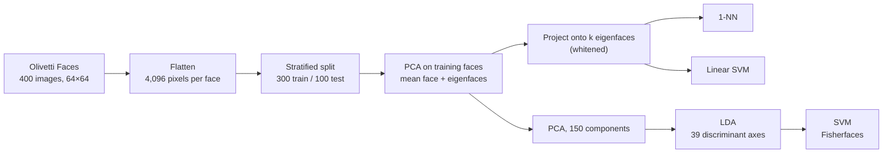

# Eigenfaces and Fisherfaces — Face Recognition with PCA

A complete face recognition pipeline built on Principal Component Analysis, evaluated on the
Olivetti Faces dataset. It follows the classical **Eigenfaces** method (Turk & Pentland,
1991) and extends it with **Fisherfaces** (Belhumeur, Hespanha & Kriegman, 1997), which
combines PCA with Linear Discriminant Analysis.

The task: given a 64×64 grayscale face image, identify which of 40 people it shows.

## Results

| Method | Test accuracy | Final dimensions | Notes |
|---|---|---|---|
| Raw pixels + 1-NN | 94.0% | 4,096 | Curse of dimensionality |
| Raw pixels + Linear SVM | 97.0% | 4,096 | Strong baseline |
| Eigenfaces (k=20) + 1-NN | 97.0% | 20 | Best 1-NN configuration |
| Eigenfaces (k=75) + Linear SVM | 98.0% | 75 | Best single-split Eigenfaces |
| Eigenfaces tuned (GridSearchCV) | 96.0% | 50 | Statistically defensible |
| **Fisherfaces (PCA=150 + LDA + SVM)** | **99.0%** | **39** | Best overall |

- **54× dimensionality reduction**: 75 components instead of 4,096 pixels, with higher
  accuracy than the raw-pixel baseline.
- **Stable across splits**: 5-fold stratified cross-validation gives 97.25% ± 1.22% for the
  best Eigenfaces configuration.
- **Supervised reduction wins**: Fisherfaces reaches 99% using only 39 dimensions
  (number of classes − 1).
- **An honest negative result**: GridSearchCV selected a more conservative model (k=50,
  C=0.1) that scored two points lower on the single test split. With 100 test samples each
  error is worth one point, so the gap is within the noise.

## How it works



1. **Each face becomes a vector.** A 64×64 image is flattened into 4,096 pixel values.
2. **PCA learns the eigenfaces.** It is fitted on the training faces only. The mean face is
   subtracted, and the principal components ("eigenfaces") are the directions in which faces
   vary the most. A few dozen of them are enough to reconstruct a recognizable face.
3. **Faces are compared in eigenface space.** Each image is replaced by its k coordinates on
   the eigenfaces (whitened, so every component has the same scale). A 1-NN or a linear SVM
   then predicts the person. The notebook sweeps k to find the best trade-off.
4. **Fisherfaces add supervision.** PCA ignores the labels, so it may keep variation that
   comes from lighting or pose rather than identity. Fisherfaces first reduce to 150 PCA
   components, then LDA finds the 39 directions (number of people − 1) that best separate the
   people, and an SVM classifies in that space.

Everything is wrapped in scikit-learn pipelines, so PCA and LDA never see the test faces.

## What the notebook covers

1. Dataset loading and exploration (400 images, 40 subjects, 10 images each)
2. Stratified train/test split
3. PCA fitting, scree plot and cumulative variance analysis
4. Mean face and eigenface visualization
5. Reconstruction quality as a function of the number of components
6. 2D and 3D projections onto the leading components
7. Classification sweep over the number of components (1-NN and Linear SVM)
8. Detailed evaluation: precision, recall, F1, confusion matrix
9. Raw-pixel baselines
10. Robustness to additive Gaussian noise
11. 5-fold stratified cross-validation
12. Joint hyperparameter tuning with GridSearchCV (components, kernel, C, gamma)
13. Fisherfaces (PCA + LDA) and visualization of the discriminant directions
14. Final comparison

## Repository contents

| File | Description |
|---|---|
| `data-analysis.ipynb` | The full notebook, with outputs and all 17 figures |
| `requirements.txt` | Python dependencies |

## Run it

```bash
pip install -r requirements.txt
jupyter notebook data-analysis.ipynb
```

Then run all cells. The Olivetti Faces dataset (about 7 MB) is downloaded automatically by
scikit-learn on the first run. The full pipeline takes 5–10 minutes on a CPU; no GPU is
needed. All randomness is fixed with `random_state = 42`, so the results are reproducible.

The notebook also runs as-is on Kaggle with internet access enabled.

## Tech stack

Python, NumPy, pandas, scikit-learn (PCA, LDA, SVM, k-NN, Pipeline, GridSearchCV),
Matplotlib, Seaborn.

## About the project

Mini project for the **Applied Machine Learning** module, Artificial Intelligence speciality,
École Supérieure en Informatique de Sidi Bel Abbès (2025/2026), submitted as a group mini
project.

### My contribution

I implemented the full pipeline in this notebook:

- Data exploration, the stratified split, PCA fitting and the variance analysis.
- Eigenface visualization, the reconstruction study and the 2D/3D projections.
- The classification sweep with 1-NN and Linear SVM, the detailed evaluation, the raw-pixel
  baselines, the noise-robustness experiment and the cross-validation analysis.
- The joint GridSearchCV tuning over the number of components, kernel, C and gamma.
- The Fisherfaces extension (PCA + LDA) and its comparison against pure Eigenfaces.
- The final comparison, discussion and conclusion.

## References

- M. Turk and A. Pentland, "Eigenfaces for recognition", *Journal of Cognitive
  Neuroscience*, 1991.
- P. Belhumeur, J. Hespanha and D. Kriegman, "Eigenfaces vs. Fisherfaces: recognition using
  class specific linear projection", *IEEE TPAMI*, 1997.
- Olivetti Faces dataset, AT&T Laboratories Cambridge.
